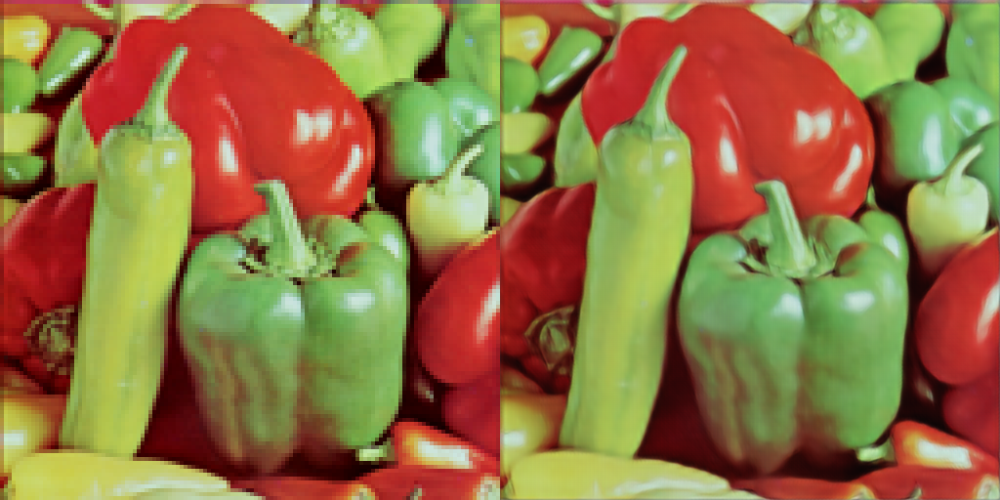

# srresnet4x
Super resolution with srresnet using TensorFlow.
the attached model is supesialized in cartoons.

I referrd this paper:https://arxiv.org/abs/1609.04802

This implementation substitutes subpixel-convolution with deconvolution because building model time is very slow with subpixel-convolution.

this implementation is not GAN.

## example
left:nearest right:output

