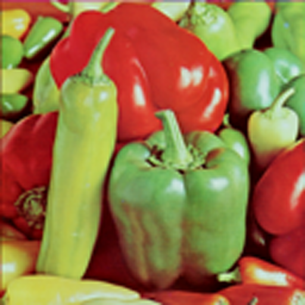

# srresnet4x
Super resolution with srresnet using TensorFlow.
the attached model is supesialized in cartoons.

I referrd this paper:https://arxiv.org/abs/1609.04802
this implementation is not GAN.

input

output

